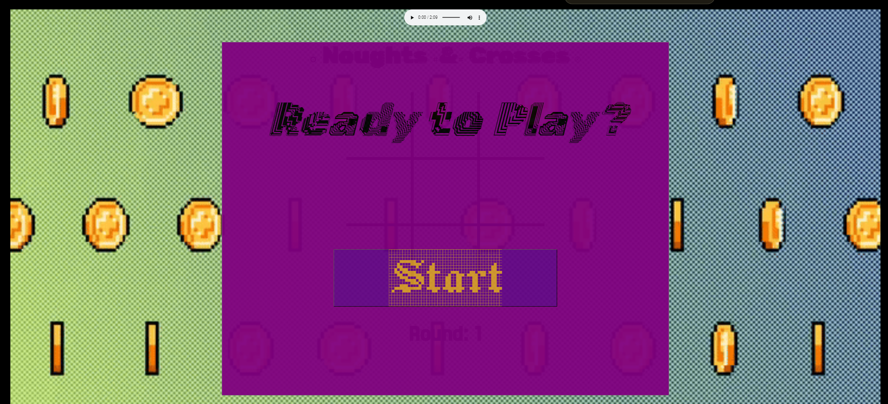
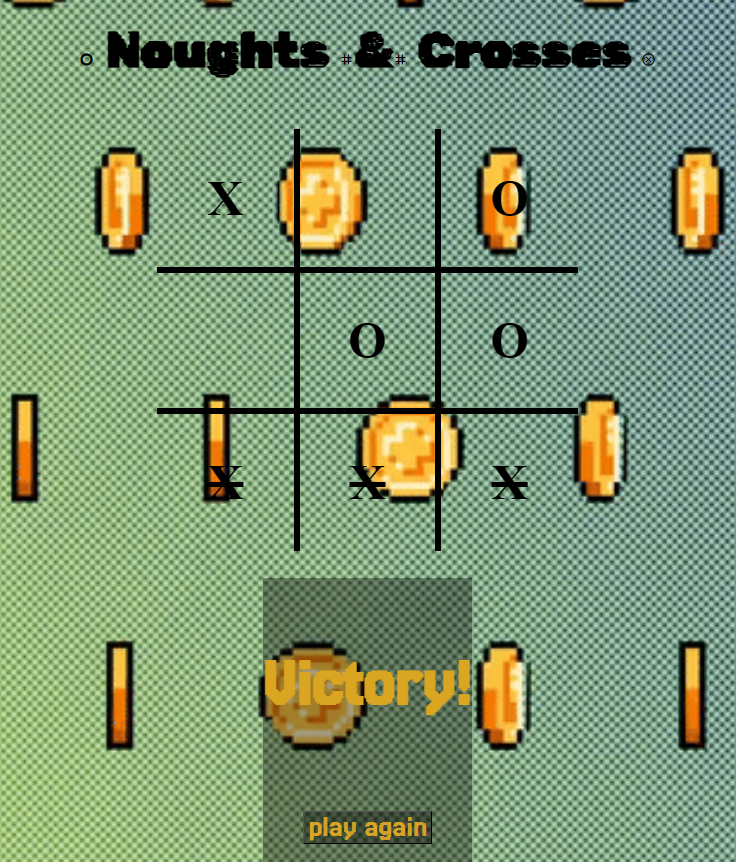

NOUGHTS & CROSSES

This is a simple example that truly exhibits what someone who is completely new to software engineering is capable of with just a week or so of study. 
For context, this is not just an example but a real project that was submitted for course work and made by someone with no previous experience in coding. 

I can't promise you won't have more than a few headaches but I can assure you that this is not nearly as difficult as you imagine it to be. 
If you are inspired, great! If you're daunted, don't be! If you're neither, then try make a game for yourself. You'll definitely have a newfound respect for the people that let you post pics of your breakfast every day!

---------------------------------------------------------------------------------------------------------------------------------------------------------

Click the link below to give my game project a try 👍

[https://shandakei.github.io/Noughts-Crosses/]

---------------------------------------------------------------------------------------------------------------------------------------------------------

ABOUT

This is a 2 player webapp to be played on the same device.

Upon clicking the link, you will be greeted with a start screen. Once you are ready to play, simply click start and jump right in.

At the end of each game, simply click the "Play Again" button rather than reloading your page. This way, you'll be able to keep track of how many rounds you have played with the round counter below the grid.

Don't forget to toggle the music player on the top of the page if you want some atmosphere while playing!

---------------------------------------------------------------------------------------------------------------------------------------------------------

COMMITS

1st commit - basics of html, css + js-switchXO(),

The first commit laid the framework as one would expect.
In order to avoid time consuming delays, html layout is key. The original body layout had 2 main divs for the startscreen and gamegrid. 
These divs had child divs necessary for page layout such as text and buttons.

CSS was kept to minimal effort as it wasn't necessary. At this point it was best to simply use borders and such.

JS was started with globals, a few event listeners and a main function which is switchXO(), made to toggle between each player. It was originally based on text-content for the conditionals.

2nd commit + 2.5 commit - audio, background, strike win count, fonts, js functioning

Due to a split from the main repo, the 2nd commit was done in two parts.

HTML was updated to include div.style to hold the mnay fonts and an attempt at transitions was made. An audio file was added too.
Layout was updated as needed including reimplementing the start screen div.

CSS underwent major updates, most notably a large video file (50MB due to editing) for the background.
Other changes included the start screen, game screen title, and grid layout.

JS was updated as needed for start screen and start button functionality. Some code blocks have been commented out for player win count + will be reimplemented later if time allows.

LANGUES, METHODS, SOURCES

HTML 
- made heavy use of classes
- more than one 'container' 
- large number of link refs
- Audio (drawn from repo, original source: [https://freemusicarchive.org/music/holiznacc0/gamer-soundtrack-game-boi/game-boi-2/]
            embed code sourced from spotify)

CSS: 

- all methods used vanilla css sectors and methods
- fonts:
    - [https://fonts.google.com/specimen/Jacquard+12+Charted]
    - [https://fonts.google.com/specimen/Rubik+Broken+Fax?query=rubik+bro&selected=Material+Symbols+Outlined:grid_3x3:FILL@0;wght@400;GRAD@0;opsz@24]
    - []

- icons [(https://fonts.google.com/icons)]
    - e5c9
    - e57b
    - f015

- Background image
    - source: @gam_ol [https://pixabay.com/videos/pixel-bit-coin-game-video-vector-20495/]
    - edit source: [https://ezgif.com/video-to-gif]
    - host: [https://imgur.com/a/5VbBhS7]

BUGS + NEEDED 

HTML snippet: <h3 class="scoreAll">Crosses wins: 0</h3>
              <h3 class="scoreAll">Noughts wins: 0</h3>

UNRESOLVED: Unable to implement 'X player win count' and 'O player win count'.
            Both were originally displayed in place of the title of the game screen. 
            Instead of incrementing by 1 point, the count would jump by multiples of 2, 3 and 4 depending on clickcount.
            Booleans caused the same issue.
            Cannot be made as a case in victory function due to cell event listener.

RESOLVED: Original README.md file was edited + commited in github rather than through terminal and VScode.
          This cause a split branch with both existing simultaneously. branches had to be merged before any commits could be pushed.

<link rel="stylesheet" href="https://cdnjs.cloudflare.com/ajax/libs/animate.css/4.1.1/animate.min.css"> 

UNMET: Attempted to make use of 'animate__bounceIn' transition for "X" and "O" text during gameplay. Unfinished due to time restraints.

Final Comments:

While not exactly as I imagined, the final result was much closer to what I had planned than I had hoped for.

It's easy to imagine you are making little progress since you spend 80-90% coding functional HTML and JS, but you can see all your progress with just a little bit of CSS.

I found that HTML is even for more important for your intended layout (for the second time).

JS functions can be confusing even if you believe you have a good (or even working understanding) of JS logic. While planning using comments in your files is helpful, having an external plan or logic flow source to refer to could help prevent tangent logic methods based on the needs of the time. 

This was an excellent short project to pursue as it covers all the basics one should know and pushes you to expand your tools, sources and built in language to achieve your intended results.